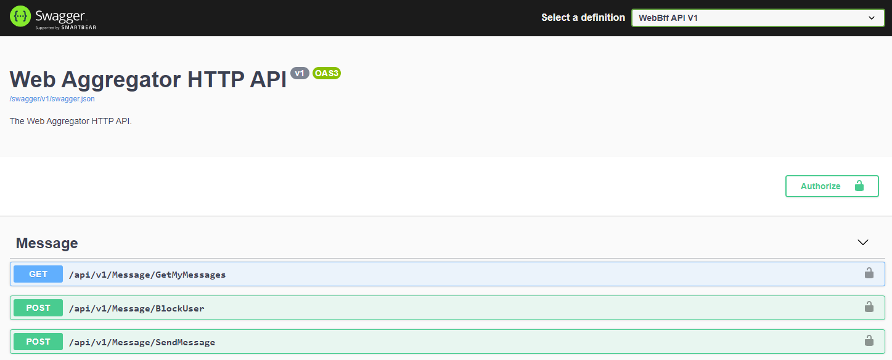

# Nasıl çalıştırılır?

### Terminal

docker-compose build

docker-compose up

###  Visual Studio

Ctrl + F5

# Proje ayağa kalktıktan sonra

Swagger üzerinden api endpointlerine ulaşılabilir. Windows dışındaki ortamlar için .env dosyasındaki parametreyi değiştirip, docker base adresi ile bağlanmanız gerekiyor. Aggregate projesi üzeri giriş noktasıdır. Tüm apiler auth istemektedir. DB olarak sql server kullanılıyor, ilk açılışta ayağa kalkması ve migrationların tamamlanması 1-2dk sürebiliyor. Swaggerda Authorize butonu ile login olunabilir.

http://host.docker.internal:7334/

# Proje yapısı hakkında bilgiler

- Auth için olarak IdentityServer4 'ün biraz değiştirilmiş bir template'i kullanılıyor
- Microservice mimarisi düşünülerek hazırlandı, api gateway(aggregate) + messaging microservisi olarak tasarlandı. Event sourcing implementasyonu scope dışında kaldığı için yapılmadı, sonradan eklenebilir

# Audit Logging

Kullanıcı oturum logları identity servera bağlanarak görülebilir, console'a yazacak şekilde ayarlı.

- Örneğin invalid login

## Notlar

- Swagger logout butonuna tıklayınca cookieleri silmediği için manuel olarak silmek gerekiyor.
  https://github.com/swagger-api/swagger-ui/issues/6049

- ".,6433" adresiyle ve "sa" - "Pass@word" ile sql servera bağlanılabilir.
